# 🌾 KrishiMitra 2.0+

<div align="center">
  <div align="center">

# 🌾 KRISHIMITRA 2.0+


</div>

  
  <h2>🚀 <em>Empowering Indian Farmers with AI-Driven Agricultural Intelligence</em></h2>
  
  <p>
    <strong>A comprehensive, multilingual farming assistant that bridges the digital divide in Indian agriculture through smart, data-driven insights and expert AI guidance.</strong>
  </p>

  <p>
    <a href="https://github.com/hopessugar/KrishiMitra.py/stargazers">
      
    </a>
    <a href="https://github.com/hopessugar/KrishiMitra.py/network/members">
      
    </a>
    
    
    
  </p>

  <p>
    <a href="#-quick-start">🚀 Quick Start</a> •
    <a href="#-features">✨ Features</a> •
    <a href="#-architecture">🏗️ Architecture</a> •
    <a href="#-contribute">🤝 Contribute</a> •
    <a href="#-roadmap">🗺️ Roadmap</a>
  </p>
</div>

---

## 🌟 **Why KrishiMitra?**

> **"Bridging the information gap between traditional farming wisdom and modern agricultural technology"**

In India, over **600 million farmers** struggle with:
- 📉 Lack of real-time market price information
- 🦠 Limited access to crop disease diagnosis
- 🏛️ Unawareness of government schemes
- 🌐 Language barriers in accessing digital resources

**KrishiMitra** solves these challenges with a comprehensive, AI-powered platform that speaks your language and understands your local context.

---

## ✨ **Core Features**

<div align="center">
  <table>
    <tr>
      <td align="center" width="33%">
        
        <h3>🩺 AI Agronomist</h3>
        <p><strong>Expert crop diagnosis and action plans</strong><br/>
        Describe your crop's situation and get comprehensive solutions with productivity tips</p>
        <span>✅ <strong>LIVE</strong></span>
      </td>
      <td align="center" width="33%">
        
        <h3>📈 Live Market Prices</h3>
        <p><strong>Real-time mandi prices & trends</strong><br/>
        Government-verified prices with 7-day trend visualization from Agmarknet</p>
        <span>✅ <strong>LIVE</strong></span>
      </td>
      <td align="center" width="33%">
        
        <h3>🌿 Disease Detection</h3>
        <p><strong>AI-powered crop health analysis</strong><br/>
        Upload leaf images for instant disease diagnosis with organic & chemical remedies</p>
        <span>🧪 <strong>PROTOTYPE</strong></span>
      </td>
    </tr>
    <tr>
      <td align="center" width="33%">
        
        <h3>🏛️ Govt. Schemes</h3>
        <p><strong>Personalized scheme recommendations</strong><br/>
        Find eligible government schemes based on your profile and land holdings</p>
        <span>✅ <strong>LIVE</strong></span>
      </td>
      <td align="center" width="33%">
        
        <h3>🌍 Crop Recommendations</h3>
        <p><strong>Location-based crop suggestions</strong><br/>
        Get suitable crops based on official Agro-Climatic Zone (ACZ) data</p>
        <span>✅ <strong>LIVE</strong></span>
      </td>
      <td align="center" width="33%">
        
        <h3>🌐 BhashaBuddy</h3>
        <p><strong>Complete multilingual support</strong><br/>
        Full UI, AI responses, and audio advice in major Indian languages</p>
        <span>✅ <strong>LIVE</strong></span>
      </td>
    </tr>
  </table>
</div>


## 🏗️ **System Architecture**

```mermaid
graph TB
    A[👤 User Interface<br/>Streamlit Frontend] --> B[🔌 REST API Gateway<br/>FastAPI Backend]
    B --> C[🤖 AI Services<br/>Google Gemini]
    B --> D[📊 Live Data APIs<br/>OpenWeather, data.gov.in]
    B --> E[🧠 ML Pipeline<br/>Disease Detection]
    B --> F[💾 Data Processing<br/>Rule-based Engines]
    
    style A fill:#e1f5fe
    style B fill:#f3e5f5
    style C fill:#fff3e0
    style D fill:#e8f5e8
    style E fill:#fce4ec
    style F fill:#fff8e1
```

<div align="center">
  
</div>



### 🔧 **Tech Stack**

<div align="center">
  <table>
    <tr>
      <td align="center"><br/><strong>Python 3.10+</strong></td>
      <td align="center"><br/><strong>FastAPI</strong></td>
      <td align="center"><br/><strong>Streamlit</strong></td>
      <td align="center"><br/><strong>Gemini AI</strong></td>
      <td align="center"><br/><strong>REST APIs</strong></td>
    </tr>
  </table>
</div>

---

## 🚀 **Quick Start**

### 📋 Prerequisites

<div align="center">
  
  
  
</div>

### ⚡ Installation

```bash
# 1️⃣ Clone the repository
git clone https://github.com/hopessugar/KrishiMitra.py.git
cd KrishiMitra

# 2️⃣ Set up virtual environment
python -m venv backend/venv

# 3️⃣ Activate environment
# Windows:
backend\venv\Scripts\activate
# macOS/Linux:
source backend/venv/bin/activate

# 4️⃣ Install dependencies
pip install -r requirements.txt
```

### 🔑 **API Configuration**

Create `backend/config.py` with your API keys:

```python
# backend/config.py
WEATHER_API_KEY = "your_openweathermap_api_key"
GEMINI_API_KEY = "your_google_ai_studio_api_key"
DATA_GOV_API_KEY = "your_data_gov_in_api_key"
```

<details>
<summary>🔗 <strong>Where to get API keys?</strong></summary>

- **OpenWeatherMap**: [openweathermap.org/api](https://openweathermap.org/api)
- **Google AI Studio**: [makersuite.google.com](https://makersuite.google.com)
- **Data.gov.in**: [data.gov.in/help/how-use-datasets-apis](https://data.gov.in/help/how-use-datasets-apis)

</details>

### 🏃‍♂️ **Run the Application**

**Terminal 1 - Backend:**
```bash
uvicorn backend.main:app --reload
```

**Terminal 2 - Frontend:**
```bash
streamlit run app.py
```

🎉 **Your browser will automatically open to the KrishiMitra dashboard!**

---

## 🤝 **Contributing**

<div align="center">
  
  <p><em>Join our amazing community of contributors!</em></p>
</div>

### 🌟 **How to Contribute**

1. **🍴 Fork** the repository
2. **🌿 Create** your feature branch: `git checkout -b feature/AmazingFeature`
3. **💡 Commit** your changes: `git commit -m 'feat: Add amazing feature'`
4. **🚀 Push** to the branch: `git push origin feature/AmazingFeature`
5. **📝 Open** a Pull Request

### 🔬 **For ML Contributors**

<div align="center">
  
</div>

Start with our **ML Research Notebook**: `Fruit disease and diagnosis predictive model.ipynb`

**Goal**: Train a robust disease detection model to replace the current mock implementation in `disease_detection.py`

**Technologies**: TensorFlow, PyTorch, Computer Vision, Deep Learning

---

## 🗺️ **Roadmap**

<div align="center">
  
  | Phase | Feature | Status | ETA |
  |-------|---------|--------|-----|
  | 🔬 | **Real ML Model Deployment** | 🔄 In Progress | 
  | 👤 | **User Authentication System** | 📅 Planned | 
  | 📚 | **Expanded Knowledge Base** | 📅 Planned | 
  | 🔔 | **Price Alert Notifications** | 📅 Planned | 
  | 📱 | **Mobile Application** | 💭 Future | 
  | 🌍 | **Regional Language Expansion** | 💭 Future |

</div>

---

## 📊 **Project Impact**

<div align="center">
  <table>
    <tr>
      <td align="center">
        
        <h3>600M+</h3>
        <p>Indian Farmers<br/>Potential Beneficiaries</p>
      </td>
      <td align="center">
        
        <h3>22+</h3>
        <p>Regional Languages<br/>Supported</p>
      </td>
      <td align="center">
        
        <h3>24/7</h3>
        <p>AI-Powered<br/>Agricultural Support</p>
      </td>
    </tr>
  </table>
</div>

---

## 📜 **License**

<div align="center">
  
  <p>This project is licensed under the <strong>MIT License</strong> - see the <a href="LICENSE">LICENSE</a> file for details.</p>
</div>

---


  
  **🌾 Made with ❤️ for Indian Farmers 🇮🇳**
  
  <p>
    <a href="https://github.com/hopessugar/KrishiMitra.py">⭐ Star this repository</a> if you found it helpful!
  </p>
  
  <p>
    <strong>Together, let's revolutionize Indian agriculture with technology! 🚀</strong>
  </p>

</div>

---

<div align="center">
  <sub>Built with 🔥 by <a href="https://github.com/hopessugar">@hopessugar</a> and the amazing KrishiMitra community</sub>
</div>